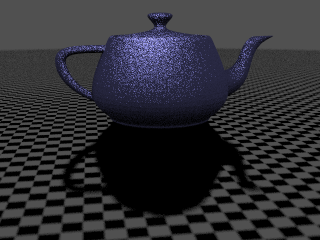
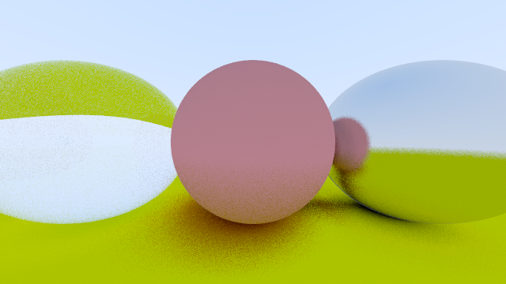

# Ocular

Ocular is a ray tracer written for fun. It follows the
[Raytracing in One Weekend](https://raytracing.github.io/) series.

## Features

### From First Book:
 - Positionable Cameras with Defocus Blur
 - Spheres
 - Antialiasing
 - Diffuse, Metal and Dielectric Materials

### From Second Book:
 - Bounding Boxes
 - Textures (only for spheres)
 - Emissive Materials (and lights)

### Additional Features:
 - Triangle Meshes
 - `.obj` File Loading
 - Multithreaded Rendering

### To Be Implemented:
 - Properly document everything
 - Loading images as textures
 - Support more image formats (only supports `.bmp` as of now)
 - UV Coordinates for Meshes
 - Instance translation and rotation
 - Volumes

## Example Renders

## Rendering Options

Options for rendering are provided as a `RenderOptions` object.

 - `width`: Width of the final image
 - `height`: Height of the final image
 - `crop_region`: Region of the camera to render
 - `samples`: No. of samples per pixel
 - `bounces`: Maximum no. of bounces per light ray
 - `clip_start`: Minimum bound for clipping
 - `clip_end`: Maximum bound for clipping
 - `block_size`: Size of each square block in a multithreaded render
